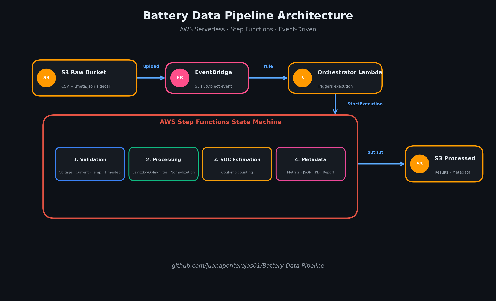

# EV Battery Data Pipeline

<p align="center">
  
</p>

A serverless AWS pipeline that processes Panasonic 18650PF battery test CSV data through validation, filtering, SOC estimation, and metadata generation — all orchestrated by AWS Step Functions.

When a CSV file and its accompanying `.meta.json` sidecar file are uploaded to an S3 bucket, the pipeline triggers automatically via EventBridge, invokes the orchestrator Lambda, and executes a four-stage Step Functions state machine. The final results (processed data and metadata) are written to a separate output bucket.

---

## Architecture Overview

```
S3 (raw bucket)
  │
  ▼
EventBridge (S3 PutObject event)
  │
  ▼
Orchestrator Lambda ──► Step Functions
                          │
                          ├── 1. Validation Lambda
                          │      • Voltage bounds, current spikes,
                          │        temperature limits, timestep checks
                          │
                          ├── 2. Processing Lambda
                          │      • Savitzky-Golay filter (w=11, p=3)
                          │      • Min-max normalization
                          │
                          ├── 3. SOC Estimation Lambda
                          │      • Coulomb counting (initial SOC from Ah column)
                          │
                          └── 4. Metadata Lambda
                                 • Average SOC, avg voltage,
                                   peak temperature, capacity discharged
                                   │
                                   ▼
                          S3 (processed bucket)
```

**Pipeline steps (all in `src/`):**

| Lambda | Source | Purpose |
|--------|--------|---------|
| `orchestrator` | `src/orchestrator/app.py` | S3 event handler, starts Step Functions execution |
| `validation` | `src/validation/app.py` | Checks voltage, current, temperature, timestep consistency |
| `processing` | `src/processing/app.py` | Savitzky-Golay smoothing, min-max normalization |
| `soc_estimation` | `src/soc_estimation/app.py` | Coulomb counting SOC |
| `metadata` | `src/metadata/app.py` | Summary metrics and report generation |

---

## Prerequisites

- [AWS SAM CLI](https://docs.aws.amazon.com/serverless-application-model/latest/developerguide/install-sam-cli.html)
- Python 3.12
- [Docker](https://docs.docker.com/get-docker/) (required for `sam build --use-container`)
- An AWS account with sufficient permissions to create Lambda functions, Step Functions state machines, S3 buckets, IAM roles, and EventBridge rules

---

## Project Structure

```
ev-battery-pipeline/
├── .github/workflows/deploy.yaml     # CI/CD pipeline (GitHub Actions)
├── src/
│   ├── orchestrator/app.py           # S3 trigger → Step Functions
│   ├── validation/app.py             # Data validation
│   ├── processing/app.py             # Filtering & normalization
│   ├── soc_estimation/app.py         # Coulomb counting SOC
│   └── metadata/app.py               # Metrics & report generation
├── examples/
│   ├── raw_data/                     # Sample raw CSV + .meta.json sidecar
│   └── processed_data/               # Sample processed CSV, metadata JSON, and PDF report
├── scripts/
│   └── local_simulator.py            # Offline testing without AWS
├── statemachine/
│   └── pipeline.asl.json             # Step Functions state machine definition
├── template.yaml                     # SAM infrastructure as code
└── samconfig.toml                    # SAM deployment configuration
```

### Example Data

The `examples/` directory contains a complete sample dataset so you can see the expected input and output formats without running the pipeline:

- **`examples/raw_data/`** — A raw battery test CSV (`raw_data.csv`) and its `.meta.json` sidecar. This is exactly what you would upload to the raw S3 bucket to trigger the pipeline.
- **`examples/processed_data/`** — The corresponding outputs after running through all four pipeline stages:
  - `processed_results.csv` — Filtered, normalized data with SOC column appended
  - `processed_results.json` — Structured metadata with test summary, key performance metrics, and data processing log
  - `report.pdf` — Professional 2-page A4 PDF report with plots and executive metrics

---

## Local Testing

The `scripts/local_simulator.py` script lets you run the full pipeline locally without any AWS resources. It simulates S3 uploads and executes all four Lambda steps sequentially on your local machine.

```bash
python scripts/local_simulator.py \
  --csv data/10degC_UDDS_Pan18650PF.csv \
  --meta data/test.meta.json \
  --output-dir ./local_output
```

**What it does:**
1. Reads the CSV file and sidecar `.meta.json`
2. Runs **Validation** (voltage, current, temperature, timestep checks)
3. Runs **Processing** (Savitzky-Golay filter + min-max normalization)
4. Runs **SOC Estimation** (Coulomb counting)
5. Runs **Metadata** (summary metrics)
6. Writes results to the specified `--output-dir`

This is the fastest way to iterate on the Lambda code or verify pipeline behaviour with new CSV samples.

---

## Deployment

### Automatic (GitHub Actions)

Push to the `main` branch to trigger the CI/CD pipeline defined in `.github/workflows/deploy.yaml`.

**Required GitHub Secrets:**

| Secret | Description |
|--------|-------------|
| `AWS_ACCESS_KEY_ID` | AWS access key |
| `AWS_SECRET_ACCESS_KEY` | AWS secret key |
| `AWS_REGION` | Target region (e.g. `us-east-1`) |

### Manual Deployment

```bash
sam build --use-container
sam deploy --guided
```

Follow the prompts:
- **Stack Name:** `battery-data-pipeline`
- **AWS Region:** your chosen region
- **Confirm changes before deploy:** `Y` (recommended for first deploy)
- **Allow SAM CLI IAM role creation:** `Y`
- **Save arguments to samconfig.toml:** `Y` (saves your choices for future `sam deploy` runs)

After deployment, SAM outputs the names of the raw and processed S3 buckets.

### Cost Considerations

Each pipeline stage is a separate Lambda invocation with S3 as the intermediate data store. For typical drive-cycle datasets (tens of thousands of rows) this is perfectly fine, but keep the following in mind if you scale up:

- **S3 requests** — Every stage performs at least one `GetObject` and one `PutObject`. Four stages = ~8 S3 requests per dataset. At scale, request charges can add up.
- **Lambda cold starts** — Step Functions invokes each Lambda sequentially. Cold-start latency (typically 100–500 ms for Python 3.12) is incurred for the first invocation after idle time. If you process many files in bursts, consider provisioned concurrency for the processing and SOC estimation functions.
- **Step Functions transitions** — Each state transition is billed. For this 4-stage pipeline the cost is negligible, but adding more stages or looping back for re-processing will increase it.

For large-scale production workloads (millions of files or GB-sized CSVs), consider:
- Batching multiple files per Lambda invocation
- Using Amazon EFS for intermediate storage instead of S3 round-trips
- Moving to a containerized ECS/Fargate job for very large files

---

## How to Customize the Stack

The two files that control the AWS infrastructure are `template.yaml` and `samconfig.toml`.

### `template.yaml` (SAM Infrastructure)

This is the **source of truth** for all AWS resources. Key sections you might want to tweak:

| Section | What to change |
|---------|---------------|
| `Globals.Function.MemorySize` / `Timeout` | Increase memory (up to 10,240 MB) or timeout (up to 900s) if you process very large CSVs. |
| `FILTER_WINDOW` / `FILTER_POLYORDER` in `src/processing/app.py` | Adjust the Savitzky-Golay smoothing parameters (not in `template.yaml`, but affects behavior). |
| `BatteryRawBucket` / `BatteryProcessedBucket` | Add lifecycle rules, cross-region replication, or logging prefixes. |
| `PipelineStateMachine` | Modify `statemachine/pipeline.asl.json` to add parallel branches, error retries, or catch blocks. |

After editing `template.yaml` (or the state machine JSON), redeploy with:

```bash
sam build --use-container
sam deploy
```

### `samconfig.toml` (Deployment Config)

This file stores the answers you gave during `sam deploy --guided` so you don't have to re-enter them:

```toml
version = 0.1
[default.deploy.parameters]
stack_name = "battery-data-pipeline"
region = "us-east-1"
confirm_changeset = true
```

You can edit this file to change the target region, stack name, or disable interactive prompts for CI/CD pipelines.

---

## Usage

### Upload Data

Upload a CSV file and its matching `.meta.json` sidecar file to the **raw** S3 bucket (the bucket name is printed by `sam deploy`).

```bash
aws s3 cp my_test.csv s3://battery-raw/raw/my_test.csv
aws s3 cp my_test.meta.json s3://battery-raw/raw/my_test.meta.json
```

### Sidecar Metadata Format

```json
{
  "cell_id": "PF_Cell_01",
  "test_date": "2023-10-27",
  "drive_cycle": "UDDS_10degC"
}
```

| Field | Description |
|-------|-------------|
| `cell_id` | Identifier for the battery cell under test |
| `test_date` | Date of the test run (ISO 8601) |
| `drive_cycle` | Drive cycle label used in output filenames |

### Pipeline Execution

1. The S3 `PutObject` event triggers EventBridge
2. The orchestrator Lambda starts the Step Functions execution
3. Each stage (Validation → Processing → SOC → Metadata) runs in sequence
4. Monitor execution in the [Step Functions console](https://console.aws.amazon.com/states/)

### Observability with AWS X-Ray

X-Ray tracing is enabled on all Lambda functions and the Step Functions state machine. After an execution completes, you can view the end-to-end trace in the [AWS X-Ray console](https://console.aws.amazon.com/xray/home):

- **Service Map** — Visual graph of the entire pipeline flow: S3 → EventBridge → Orchestrator → Step Functions → Validation → Processing → SOC → Metadata → S3
- **Trace Timeline** — Waterfall view showing latency for each stage, including cold starts and data transfer between steps
- **Filtering** — Search traces by drive cycle, cell ID, or time range to diagnose specific executions

This makes it easy to identify bottlenecks, compare execution durations across drive cycles, and debug failures visually.

### Outputs

Results are written to the **processed** S3 bucket:

```
s3://battery-processed/results/<drive_cycle>_<test_date>.csv
s3://battery-processed/metadata/<drive_cycle>_<test_date>.json
```

- **`results/`** — Contains the processed CSV with filtered, normalized data and SOC column appended.
- **`metadata/`** — Contains a JSON summary with average SOC, average voltage, peak temperature, and total capacity discharged.

### Report Generation (OpenCode Skill)

This repository includes a custom **OpenCode skill** (`.opencode/skills/generate-report/`) that automatically lists available datasets from S3 and generates professional 2-page A4 PDF reports with executive metrics, time-series plots, and data processing notes.

The skill is designed to be **portable** — the underlying Python script can be invoked from any coding agent or CLI tool, including Claude Code, GitHub Copilot, Cursor, or a plain terminal:

```bash
python .opencode/skills/generate-report/generate_report.py list
python .opencode/skills/generate-report/generate_report.py generate <dataset_name>
```

Because the report generator is a standalone script with no OpenCode-specific dependencies, you can drop it into any workflow where you need quick, repeatable battery test visualizations.

---

## Data Processing Details

### Validation (`validation/app.py`)

| Check | Rule |
|-------|------|
| Voltage bounds | Reject readings outside 2.5 V – 4.2 V |
| Current spikes | Flag or reject current > 5 A |
| Temperature range | Flag or reject temperature > 45 °C |
| Timestep consistency | Ensure uniform sampling interval; flag gaps |

### Processing (`processing/app.py`)

- **Savitzky-Golay filter** applied to voltage and current signals (window = 11, polynomial order = 3) to reduce noise while preserving the underlying trend.
- **Min-max normalization** scales each column to the [0, 1] range, enabling comparisons across different test runs.

### SOC Estimation (`soc_estimation/app.py`)

- Uses **Coulomb counting** to compute the state of charge over time.
- The initial SOC is inferred from the cumulative `Ah` column:  
  `SOC₀ = 1.0 - (cumulative_Ah_first / total_capacity_Ah)`
- Each subsequent timestep integrates current over time:  
  `SOC(t) = SOC₀ - (∫ I dt) / total_capacity_Ah`

> **Limitation:** Coulomb counting drifts over time because it accumulates sensor error. It also assumes the current sensor is perfectly calibrated and that the cell's total capacity (`Q_CAPACITY_AH = 2.9`) is constant across temperature and aging. For research-grade SOC estimation, consider fusing this with an open-circuit-voltage (OCV) lookup or a Kalman filter.

### Metadata (`metadata/app.py`)

The JSON report includes:

- `average_soc` — Mean SOC across the test cycle
- `average_voltage` — Mean voltage after filtering
- `peak_temperature` — Maximum recorded temperature
- `capacity_discharged` — Total Ah discharged over the cycle

---

## Cleanup

To delete all deployed AWS resources:

```bash
sam delete --stack-name battery-data-pipeline
```

This removes the CloudFormation stack, including the Lambda functions, Step Functions state machine, S3 buckets, IAM roles, and EventBridge rules.

---

## License

This project is licensed under the [MIT License](LICENSE). You are free to use, modify, and distribute this software in accordance with the terms of the license.
